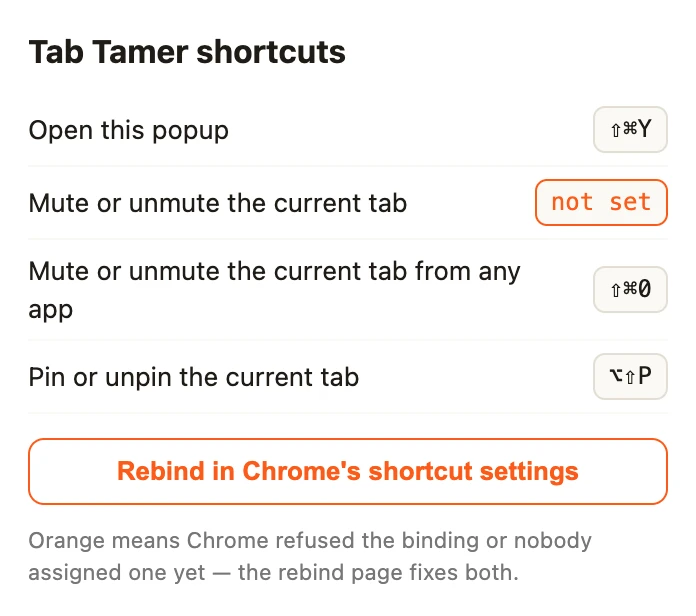

# Tab Tamer — keyboard shortcuts with `chrome.commands`

A four-file extension that asks for **zero permissions** and works from the
keyboard: pin the current tab, mute it, mute it *globally* while Chrome is in
the background, and open a popup that lists every shortcut as Chrome actually
bound it — including the ones it refused. No build step, no dependencies, no
binary assets.

It is the companion sample for the
[blog tutorial on `chrome.commands`](https://blog.extenshi.io/posts/chrome-extension-keyboard-shortcuts-commands),
which explains line by line *why* the code is shaped the way it is.

## The one thing to understand

A suggested shortcut that something else already owns does not raise an error:
the extension loads and the command simply comes back with an empty
`shortcut`. So the service worker checks `chrome.commands.getAll()` once on
install and puts a `!` on the toolbar badge if any chord is missing, and the
popup shows the unbound one in orange with a button that opens
`chrome://extensions/shortcuts` via `tabs.create()` (a plain link to that URL is
blocked).

## Files

| File | Role |
|---|---|
| `manifest.json` | MV3; four `commands` with suggested keys (the maximum), one of them `global`; the reserved `_execute_action` opens the popup; no `permissions` key |
| `background.js` | Top-level `onCommand` listener → pin / mute the active tab; install-time collision check that sets the `!` badge |
| `popup.html` / `popup.js` | Cheat sheet from `chrome.commands.getAll()`, unbound commands marked "not set"; Rebind button opens Chrome's shortcut manager |

## Run it

1. Load the folder via `chrome://extensions` → **Developer mode** → **Load unpacked**.
2. Press **Alt+Shift+P** (⌥⇧P on a Mac) on any tab to pin it, **Alt+Shift+M** (⌥⇧M) to mute it.
3. Switch to another application and press **Ctrl+Shift+0** (⌘⇧0 on a Mac): the
   active tab of the last Chrome window toggles mute.
4. Press **Ctrl+Shift+Y** (⌘⇧Y) for the cheat sheet; **Rebind** opens
   `chrome://extensions/shortcuts`.

## Permissions

None — `pinned` and `mutedInfo` are not among the tab fields the `"tabs"`
permission gates, so there is no install-time warning.

Apache-2.0 credit: the pin toggle follows Google's `api-samples/tabs/pin`, and
the collision check adapts the "Verify commands registered" example from the
chrome.commands docs, both reworked. This sample is MIT, like the rest of this
repository.
