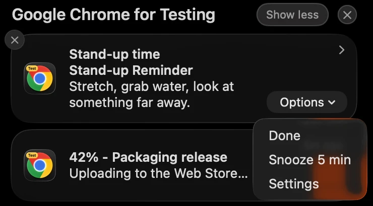

# Stand-up Reminder — notification buttons that survive the MV3 service worker

A four-file Chrome extension: pick a reminder interval in the toolbar popup,
and when the alarm fires Chrome raises a system notification with **Done** and
**Snooze 5 min** buttons. The buttons keep working minutes later, after Chrome
has terminated the idle service worker. No build step, no dependencies, no
binary assets (the icon is a `data:` URL).

It is the companion sample for the
[blog tutorial on `chrome.notifications` action buttons in MV3](https://blog.extenshi.io/posts/chrome-notifications-action-buttons-mv3),
which explains line by line *why* the code is shaped the way it is.

## The one thing to understand

`onButtonClicked` fires whenever the *user* clicks, often long after the
worker that called `create()` is gone. Chrome cold-starts a fresh worker to
deliver the click, so every listener is registered synchronously at the top
level of `background.js`, and nothing the handler needs lives in a variable:
the intent is encoded in the notification id (`reminder:standup`) and the
interval is read from `chrome.storage.sync` at click time.

## Files

| File | Role |
|---|---|
| `manifest.json` | MV3; permissions `alarms`, `notifications`, `storage` |
| `background.js` | Top-level listeners: alarm → notification; button index → intent (`done` re-arms from storage, `snooze` sets a 5-minute alarm); badge cleanup on close |
| `popup.html` / `popup.js` | Writes the chosen interval to `storage.sync`, arms the alarm, or stops reminders |

## Run it

1. Load the folder via `chrome://extensions` → **Developer mode** → **Load unpacked**.
2. Pin the icon, open the popup, choose **1 minute (testing)**, close the popup.
3. When the notification lands, wait two minutes with DevTools closed (the
   worker's ~30 s idle timeout expires; `chrome://extensions` shows
   `service worker (Inactive)`), then click **Snooze 5 min**. On macOS the
   buttons sit under the notification's **Options** menu, and with Do Not
   Disturb on the notification goes straight to Notification Center, where the
   buttons work too.
4. Click **Done** on the next one: the badge returns to `ON` and a fresh alarm is
   armed with the interval from storage. **Stop reminders** clears it.

## Permissions

`alarms`, `notifications` and `storage`. `notifications` is the only one with an
install-time warning ("Display notifications"). No host permissions, no `tabs`.

Apache-2.0 credit: the flow leans on Google's `api-samples/richNotification` and
`functional-samples/sample.water_alarm_notification`, reworked. This sample is
MIT, like the rest of this repository.
