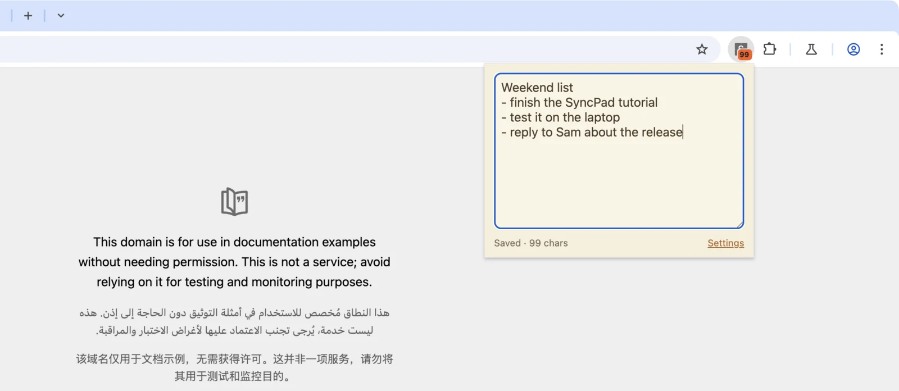

# SyncPad — settings in `chrome.storage.sync`, the note in `local`

A six-file scratchpad extension that draws the line most storage tutorials
skip: **small, JSON-friendly settings** (theme, font size, a badge toggle) go
into `chrome.storage.sync` and follow the user to every signed-in Chrome,
while **the note itself** stays in `chrome.storage.local` because sync caps
every item at 8 KB. No build step, no dependencies, no binary assets.

It is the companion sample for the
[blog tutorial on `chrome.storage.sync`](https://blog.extenshi.io/posts/chrome-storage-sync-cross-device-settings),
which explains line by line *why* the code is shaped the way it is.

## The one thing to understand

`chrome.storage.onChanged` is the only "something changed elsewhere" signal
there is: it fires for another window of the extension, for a revived service
worker, and for a write that arrived from another device through Chrome Sync.
The popup repaints from it, the options page mirrors it, and the service
worker rebuilds the toolbar badge from it — so nothing important lives in a
variable that a 30-second idle timeout can erase.

## Files

| File | Role |
|---|---|
| `manifest.json` | MV3; the single `storage` permission; popup, options page (`open_in_tab`) and service worker |
| `options.html` / `options.js` | Writes theme / font size / badge to `storage.sync` (the slider is debounced for the 120-writes-per-minute cap); live quota readout via `getBytesInUse` |
| `popup.html` / `popup.js` | Note autosave to `storage.local`; settings read from `storage.sync` with `get(DEFAULTS)`; live repaint on `onChanged` |
| `background.js` | Top-level `onChanged` listener keeps the character-count badge in step; the badge is restored from storage on every cold start |

## Run it

1. Load the folder via `chrome://extensions` → **Developer mode** → **Load unpacked**.
2. Pin the icon, open the popup and type a few lines — the badge counts characters.
3. Open **Settings**, switch the theme or drag the font size: an already-open
   popup repaints with no reload.
4. Signed in to Chrome with sync on? Load the same folder on a second machine
   (or a second profile on the same account): the settings arrive, the note does not.

## Permissions

`storage` only — no host permissions, no install-time warning.

Apache-2.0 credit: the build leans on Google's `api-samples/storage/stylizr`,
reworked. This sample is MIT, like the rest of this repository.
